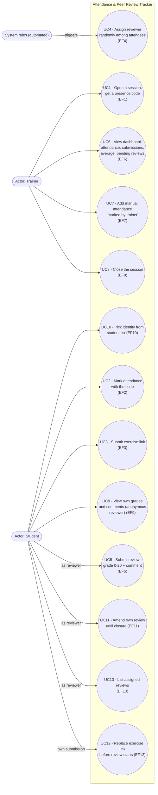

# D1 — Use case diagram

> Actors on the left, system boundary in the middle, automated system rules on the right.
> The "Reviewer" is NOT a distinct actor: it is a student in a transient role (see CDC §2).

## Notes

- **Reviewer = student in a state**: no separate actor, because a reviewer keeps all
  student capabilities and the data model stores the reviewer as a student (RG4, RG6).
- **System rules (right)**: reviewer assignment (Q7) is system-automated, hence the
  dashed trigger from the automated-rules actor to UC4.
- Extension points: UC2 includes rate limiting after 5 failed attempts (RG3, → 400 TOO_MANY_ATTEMPTS);
  UC3 requires prior attendance (RG14, → 400 PRESENCE_REQUISE).
