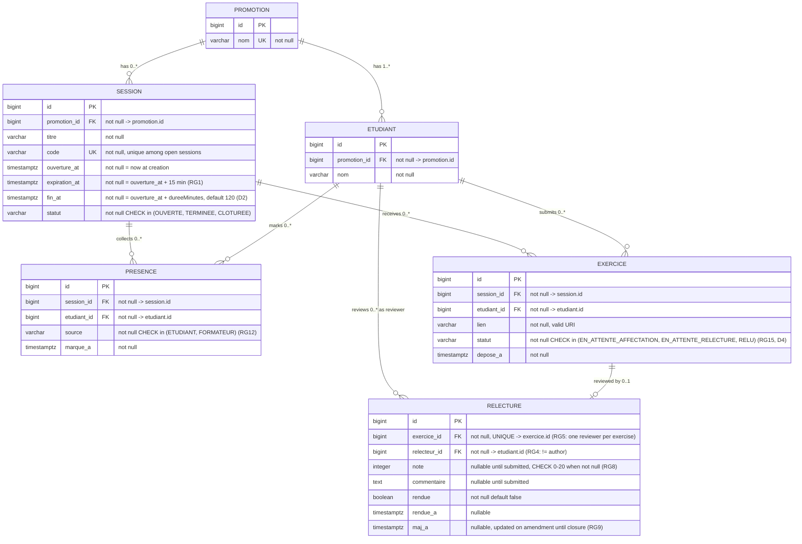

# D2 — Data model (ER diagram)

> This diagram is the exact mirror of the Flyway migrations (`backend/src/main/resources/db/migration`).
> Any schema change must update both, in the same PR. Crow's foot notation.

## Invariants enforced beyond the schema

| Invariant | How | Rule |
|---|---|---|
| One presence per (session, student) | `UNIQUE (session_id, etudiant_id)` on PRESENCE | Q2/Q3 |
| One review per exercise | `UNIQUE (exercice_id)` on RELECTURE | RG5 (Q6) |
| Reviewer ≠ author | service check → `403 AUTO_RELECTURE` | RG4 (Q5) |
| Reviewer among session attendees | service check at assignment | RG6 (Q7) |
| Attendance before submission | service check → `400 PRESENCE_REQUISE` | RG14 (D4/H4) |
| Rate limit on wrong codes | failed-attempt counter per student, 5 → 2 min lock | RG3 (Q4) |
| Link replaceable until review starts | service check → `409 RELECTURE_COMMENCEE` | RG11 (Q13) |
| Session closure freezes changes | status check on all write paths | RG9/RG10 |

> Integrity rules that PostgreSQL can enforce are enforced in the schema (UNIQUE, CHECK).
> Business rules that need context (rate limiting, attendance-before-submission,
> reviewer eligibility) live in the service layer and are covered by unit tests.
