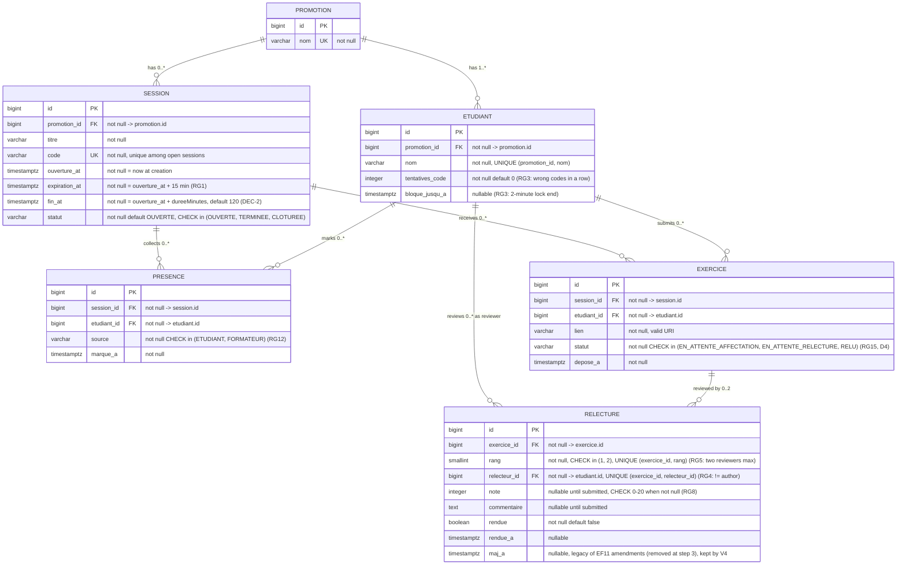

# D2 — Data model (ER diagram)

> This diagram is the exact mirror of the Flyway migrations (`backend/src/main/resources/db/migration`).
> Any schema change must update both, in the same PR. Crow's foot notation.

## Invariants enforced beyond the schema

| Invariant | How | Rule |
|---|---|---|
| One presence per (session, student) | `UNIQUE (session_id, etudiant_id)` on PRESENCE | Q2/Q3 |
| One exercise per (session, student) | `UNIQUE (session_id, etudiant_id)` on EXERCICE → `409 EXERCICE_DEJA_DEPOSE` | contract |
| One student name per promotion | `UNIQUE (promotion_id, nom)` on ETUDIANT (identity picked by name, Q1) | EF10 |
| Code unique among open sessions | partial unique index `uniq_session_code_active` (`statut <> 'CLOTUREE'`) | DEC-5 |
| Two distinct reviewers per exercise, never three | `rang CHECK (1, 2)` + `UNIQUE (exercice_id, rang)` + `UNIQUE (exercice_id, relecteur_id)` on RELECTURE (V4) | RG5 revised (step 3) |
| Retained grade and provisional flag | computed by the service from the rendered reviews, never stored | RG16, DEC-13 |
| Reviewer ≠ author | service check → `403 AUTO_RELECTURE` | RG4 (Q5) |
| Reviewer among session attendees | service check at assignment | RG6 (Q7) |
| Attendance before submission | service check → `400 PRESENCE_REQUISE` | RG14 (DEC-4) |
| Rate limit on wrong codes | failed-attempt counter per student, 5 → 2 min lock | RG3 (Q4) |
| Link replaceable until review starts | service check → `409 RELECTURE_COMMENCEE` | RG11 (Q13) |
| Session closure freezes changes | status check on all write paths → `409 SESSION_CLOTUREE`; the code of a closed session → `410 CODE_EXPIRE` | RG9/RG10, DEC-11 |

> Integrity rules that PostgreSQL can enforce are enforced in the schema (UNIQUE, CHECK).
> Business rules that need context (rate limiting, attendance-before-submission,
> reviewer eligibility) live in the service layer and are covered by unit tests.

> `TERMINEE` is allowed by the CHECK constraint but never persisted: a session is "ended" when
> `now > fin_at` (RG2), computed at request time, so no scheduler has to flip the status. Only
> `OUVERTE → CLOTUREE` is written (EF8). V2 and V3 are data-only migrations (demo seed): D2 is
> unchanged by them.

> **Step 3 (V4, consequence of the two-reviewer change).** `UNIQUE (exercice_id)` is dropped,
> `rang` is added (existing reviews get rank 1), exercises with a single reviewer go back to
> `EN_ATTENTE_AFFECTATION` (DEC-14). V1–V3 are untouched.
