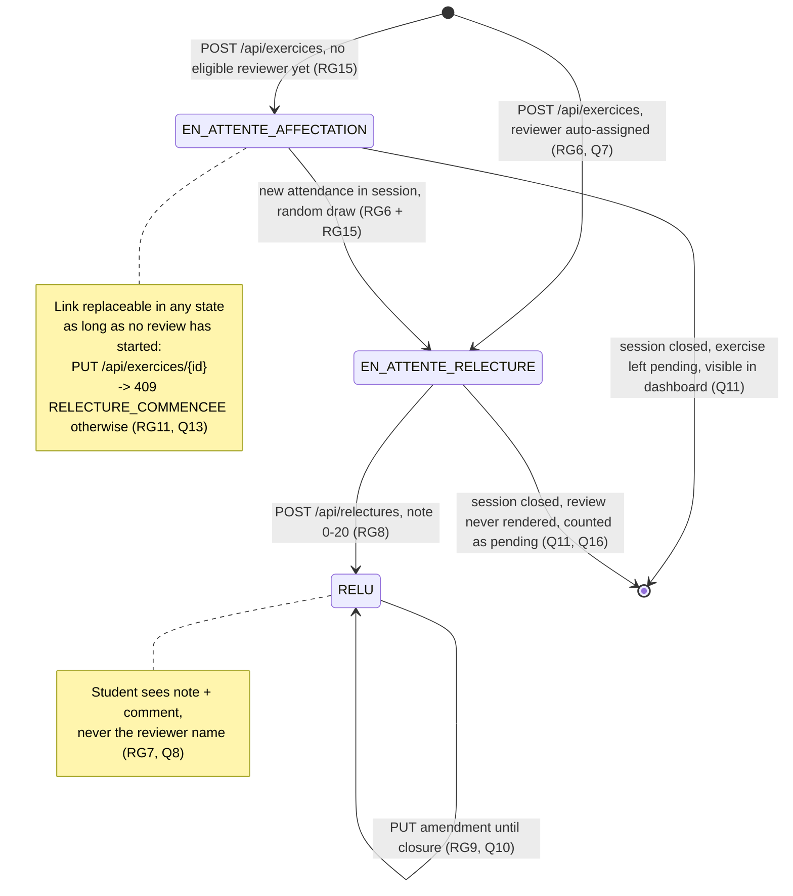

# D4 — State machine: exercise lifecycle (BONUS diagram)

> Bonus diagram (+3). States match the `statut` CHECK constraint of the EXERCICE
> table in D2 and the `statut` enum of `/api/exercices` in the contract.

## State transitions table

| From | Event | To | Guard / side effect |
|---|---|---|---|
| — | `POST /api/exercices` (attendance OK, RG14) | `EN_ATTENTE_AFFECTATION` or `EN_ATTENTE_RELECTURE` | if another eligible attendee exists → draw reviewer immediately; else pending assignment |
| `EN_ATTENTE_AFFECTATION` | new `POST /api/presences` in the session | `EN_ATTENTE_RELECTURE` | random draw among attendees ≠ author (RG6, RG15) |
| `EN_ATTENTE_RELECTURE` | `POST /api/relectures/{id}` by assignee | `RELU` | note 0–20 integer (RG8) → exercise becomes reviewed |
| `RELU` | `PUT /api/relectures/{id}` by assignee | `RELU` | allowed until session closure (RG9, D1) |
| any | trainer closes session (EF8) | terminal | no more submissions (RG10), no more amendments (RG9) |
