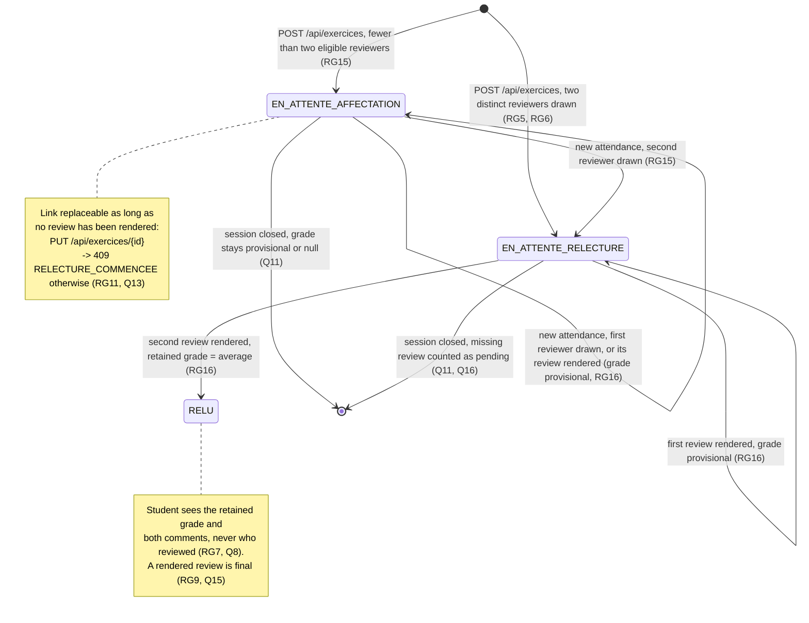

# D4 — State machine: exercise lifecycle (BONUS diagram)

> Bonus diagram (+3). **Revised at step 3** (two reviewers per exercise, EF11 removed). States match the `statut` CHECK constraint of the EXERCICE
> table in D2 and the `statut` enum of `/api/exercices` in the contract.

## State transitions table

| From | Event | To | Guard / side effect |
|---|---|---|---|
| — | `POST /api/exercices` (attendance OK, RG14) | `EN_ATTENTE_AFFECTATION` or `EN_ATTENTE_RELECTURE` | up to two reviewers drawn at once; `EN_ATTENTE_RELECTURE` only when two are assigned |
| `EN_ATTENTE_AFFECTATION` | new `POST /api/presences` in the session | `EN_ATTENTE_AFFECTATION` or `EN_ATTENTE_RELECTURE` | missing reviewer(s) drawn among attendees ≠ author and ≠ current reviewer; `EN_ATTENTE_RELECTURE` once two are assigned (RG5, RG15) |
| `EN_ATTENTE_RELECTURE` | first `POST /api/relectures/{id}` | `EN_ATTENTE_RELECTURE` | grade shown, marked provisional (RG16) |
| `EN_ATTENTE_RELECTURE` | second `POST /api/relectures/{id}` | `RELU` | retained grade = average of the two (RG16) |
| any | trainer closes session (EF8) | terminal | no more submissions nor reviews (RG9, RG10) |
